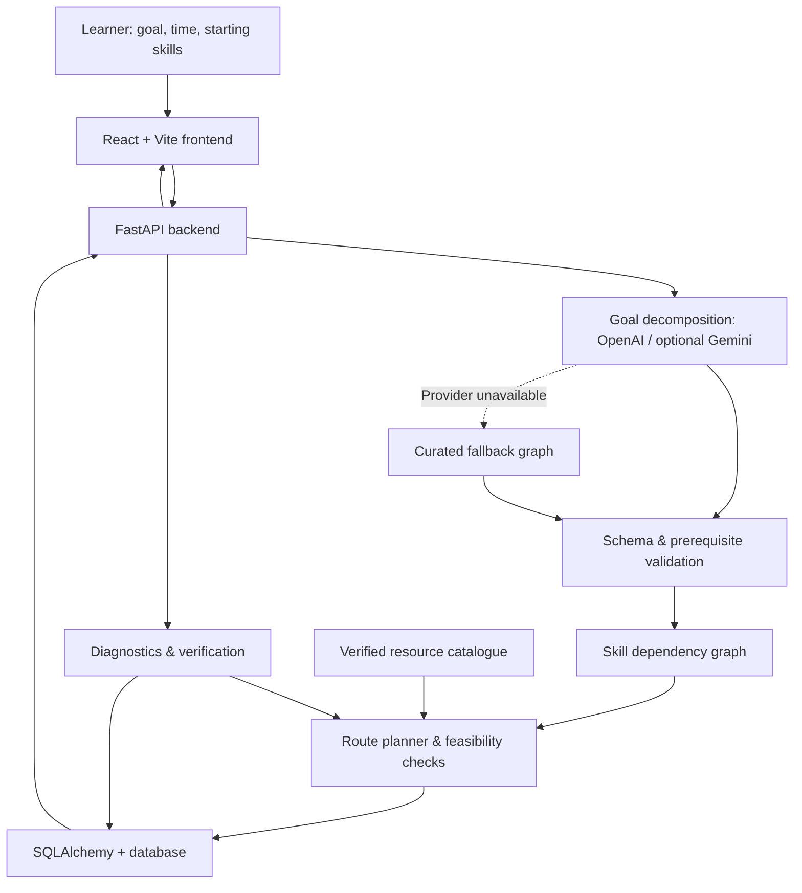

🪐 ORBIT
Your goal has a route. ORBIT finds it.
From resource overload to an actionable, prerequisite-aware learning plan.
🚀 Try ORBIT · 💻 Source Code
Codeblitz 2.0 · 2026  |  Team Revengers

🎯 The problem: more resources, less direction
A student wants to become a machine learning engineer. They find hundreds of tutorials, playlists, roadmaps, and courses. But the questions that matter remain unanswered:
- What should I learn first? Which skills depend on other skills?
- What do I already know? Am I repeating the basics or skipping important foundations?
- What fits my life? Can I realistically finish with eight hours per week?
- How do I measure progress? Is watching a video the same as understanding a topic?
Two learners may have the same destination but completely different starting points. A generic roadmap treats them alike. ORBIT is built to plan around the learner, not just the topic.

💡 What is ORBIT?
ORBIT is an intelligent learning navigator that converts a goal into a structured route. It combines AI-assisted skill decomposition with a prerequisite graph, starting-level diagnostics, curated learning resources, time-budget calculations, and skill verification.
Instead of presenting another long list of links, ORBIT helps answer:
Given my goal, what should I work on next—and why?

The learner journey
          YOUR GOAL
              │
              ▼
      1. GOAL & SKILL GRAPH
      Identify skills and dependencies
              │
              ▼
      2. DIAGNOSE & FIND GAPS
      Estimate what you already know
              │
              ▼
      3. BUILD A FEASIBLE ROUTE
      Match resources to time and prerequisites
              │
              ▼
      4. LEARN & VERIFY
      Work through skills and track progress
              │
              └──────► RE-PLAN AS NEEDED
              
✨ Core features
Feature	What it does	Why it matters
Goal → skill graph	Decomposes a learning goal into skills and explicit prerequisite relationships.	Makes the order of learning visible instead of arbitrary.
Starting-point diagnostic	Helps estimate the learner's current understanding before planning next steps.	Reduces unnecessary repetition and exposes knowledge gaps.
Personalized route	Accounts for the goal, current skills, hours per week, timeline, and relevant preferences.	A route should reflect what an individual can realistically do.
Curated resource matching	Connects skills to a catalogue of real learning resources and identifies gaps where no verified resource is available.	Does not need to invent a course link to fill every slot.
Feasibility checks	Compares estimated learning hours with the learner's available time.	Makes unrealistic schedules visible before the learner commits to them.
Skill verification & progress	Distinguishes estimated knowledge from progress demonstrated through checks.	Completing a resource is not automatically the same as mastering a skill.
Re-planning	Supports adjusting the learner's route when constraints or progress change.	The plan can evolve instead of remaining a static PDF.
AI-provider fallback	Attempts AI-powered graph generation and uses a curated fallback when providers are unavailable.	Preserves a usable experience while clearly identifying fallback content.

🔍 What makes it different from a generic AI roadmap?
An AI chatbot can suggest a sequence of topics. ORBIT adds an application layer around those suggestions:
1. Explicit dependencies: Skills are represented as a graph, so prerequisite ordering can be checked.
2. A learner-specific starting point: Diagnostics and skill status inform what remains to be learned.
3. A time-aware plan: Resource durations are checked against the user's weekly availability and deadline.
4. A connected workflow: Goal-setting, diagnostics, route construction, resources, and verification live in one application.
5. Transparent fallbacks: If AI generation is unavailable, ORBIT labels curated fallback content instead of presenting it as a fresh AI result.
Example: ORBIT can say “this plan doesn't fit”
Suppose the selected resources require 91 hours, but the learner allows 8 weeks × 10 hours/week = 80 hours.
Required learning time:  91 hours
Available study time:   80 hours
Shortfall:              11 hours
ORBIT can flag the mismatch and suggest making more time available or extending the learning horizon. The aim is not simply to recommend what to learn, but to make the route explainable and feasible.
🧭 Try the working prototype
Live web application: https://orbit-learning-navigator.vercel.app/
For a quick walkthrough:
1. Goal: Enter a goal such as “Become a Machine Learning Engineer” and choose a timeline and weekly hours.
2. Diagnose: Explore the capability map and attempt the starting-point assessment.
3. Build Route: Inspect the ordered learning route, resources, prerequisite status, and feasibility calculations.
4. Learn & Verify: Open a skill, study the linked material, and explore skill checks and progress tracking.
Demo note: A goal with an already-saved graph displays that existing graph, including its recorded source. To test fresh AI generation, create a new goal. AI availability also depends on the configured provider and API quota; the application can display a clearly labeled curated fallback.

🏗️ Architecture

Design principle: AI helps interpret the goal; structured validation and deterministic application logic handle prerequisite rules, scheduling calculations, persistence, and learner progress.
Technology stack
Layer	Technologies
Frontend	React, Vite, JavaScript, CSS / Tailwind
Backend	Python, FastAPI, Pydantic, HTTPX
AI-assisted generation	OpenAI (primary); Gemini (optional secondary); curated fallback
Learning logic	Dependency graph, prerequisite ordering, gap analysis, resource-duration and time-budget calculations
Data layer	SQLAlchemy; SQLite for local development, PostgreSQL for deployed persistence
Deployment	Vercel (frontend), Render (FastAPI backend)
Testing	Pytest for backend, Vite production build and Oxlint for frontend

External AI API keys stay on the backend. They are never intended to be embedded in browser-side VITE_ environment variables.
🗂️ Project structure
frontendapogee/
├── backend/
│   ├── main.py               # FastAPI application and route registration
│   ├── config.py             # Backend configuration
│   ├── routes/               # Goals, graphs, diagnostics, routes, verification
│   ├── services/             # AI generation, resources, planning, assessment
│   ├── models/               # Persistence models
│   ├── db/                   # Database connection and sessions
│   ├── tests/                # Backend tests
│   └── requirements.txt
├── src/
│   ├── components/           # Interface and learner-journey components
│   ├── services/api.js       # Frontend → backend API client
│   └── App.jsx
├── public/                   # Static assets
├── package.json
└── README.md
⚙️ Run locally
Prerequisites: Git, Node.js + npm, and Python 3 with venv support. Some AI-assisted features require a provider API key; otherwise curated fallback behavior may be used.
1. Clone the repository
git clone https://github.com/aamina15/frontendapogee.git
cd frontendapogee
2. Start the FastAPI backend
cd backend
python3 -m venv .venv
source .venv/bin/activate          # On Windows: .venv\Scripts\activate
pip install -r requirements.txt
Create backend/.env with your own server-side credentials (do not commit it):
AI_PROVIDER=openai
OPENAI_API_KEY=replace_with_your_own_key
OPENAI_MODEL=gpt-4o-mini

# Optional secondary provider:
# GEMINI_API_KEY=replace_with_your_own_key
Then start the API from the backend/ directory:
python3 -m uvicorn main:app --reload --port 8000
Check: http://127.0.0.1:8000/health · API docs: http://127.0.0.1:8000/docs
By default, local development can use SQLite. For a deployed PostgreSQL instance, provide DATABASE_URL as a server process environment variable and configure CORS for your frontend origin. Do not commit connection strings or passwords.
3. Start the frontend
Open a second terminal in the repository root:
npm ci
VITE_API_BASE_URL=http://127.0.0.1:8000 npm run dev
Visit the local URL printed by Vite (normally http://localhost:5173).
Production configuration: Set VITE_API_BASE_URL to the public FastAPI URL in Vercel, and set OPENAI_API_KEY, AI_PROVIDER, and any database credentials in the Render backend environment. Redeploy after changing build-time Vite variables.

🧪 Tests and verification
# From backend/
python3 -m pytest -q

# From the repository root
npm run build
npm run lint
The OpenAI integration includes mocked provider tests for successful generation, fallback behavior, malformed responses, and avoiding credential leakage. These tests do not require making paid API calls. A successful live AI request must be verified separately with valid credentials and quota.
⚠️ Prototype scope and honest limitations
ORBIT is a hackathon MVP, not a claim that every learning goal already has complete content coverage.
- Resource coverage: The current matching service uses a verified resource catalogue. If there is no match, it can report a resource gap rather than fabricate a URL. Broader live resource discovery is an area for expansion.
- AI availability: OpenAI and optional Gemini are external services with separate credentials and rate limits. Curated fallback graphs are labeled and may remain saved for an existing goal.
- Assessment: Diagnostics estimate a starting level; skill checks provide evidence of progress, but neither should be treated as a professional qualification.
- Personalization: The prototype is designed around a learner journey; multi-user authentication and broader production-scale user management are future work.
- Impact: Benefits such as less resource-hunting and less redundant study are intended outcomes; they have not been presented here as measured results from a controlled user study.
🌱 Where we want to take ORBIT next
- Expand validated resource coverage across more learning domains.
- Add broader resource-search integrations with quality and freshness checks.
- Improve feedback-driven route adjustment and longer-term learner analytics.
- Extend multi-user accounts and personalized progress history.
- Evaluate outcomes with learners, including time-to-first-action, route completion, and verified skill progress.

👥 Team Revengers
Built for Codeblitz 2.0 (2026) by:
Member	Team role
Aditya Agarwal	Team Leader
Aditya Tiwari	Team Member
Aamina Hasan	Team Member

Stop searching for what to learn. Start knowing what comes next.
ORBIT — From overwhelmed to on track.
🚀 Open the live demo
